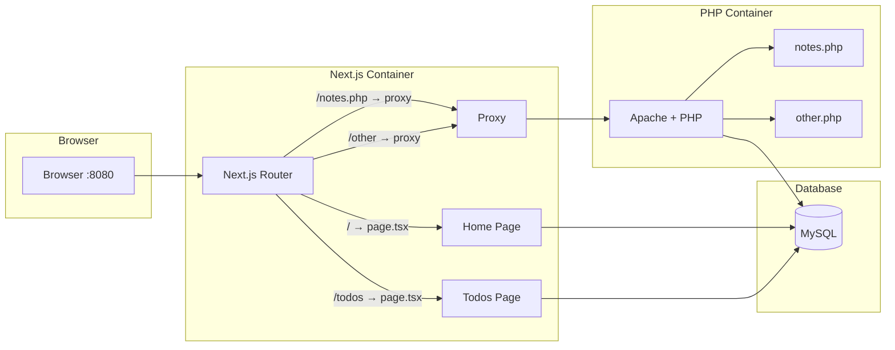

# PHP to Next.js Migration Demo

A demonstration of the **Strangler Fig Pattern** for incrementally migrating a legacy PHP application to Next.js.

## What is the Strangler Fig Pattern?

The Strangler Fig pattern is a migration strategy named after strangler fig trees, which grow around existing trees and eventually replace them. In software, this means:

1. **Create a new system alongside the old one** - Deploy the new application (Next.js) as a reverse proxy in front of the legacy application (PHP)
2. **Incrementally migrate features** - Route new or migrated functionality to the new system while unchanged features continue to be served by the legacy system
3. **Gradually replace** - As more features are migrated, the legacy system handles less traffic
4. **Remove the old system** - Once all features are migrated, the legacy system can be decommissioned

This approach minimizes risk by allowing incremental migration with the ability to roll back individual features if issues arise.

## Project Structure During Migration
```
php-migration-demo/
├── docker-compose.yml      # Orchestrates all containers
├── Dockerfile              # PHP/Apache container
├── php-site/               # Legacy PHP application
│   ├── index.php           # Home page
│   ├── todos.php           # To-Do CRUD
│   ├── notes.php           # Notes display
│   └── includes/
│       ├── db.php          # MySQL connection
│       ├── header.php      # Shared header/nav
│       └── footer.php      # Shared footer
└── next-site/              # New Next.js application
    ├── app/
    ├── lib/
    ├── Dockerfile
    └── next.config.ts      # Proxy config to PHP
```

## Architecture

### Request Flow During Migration



## Migration Process

This project demonstrates a complete migration from PHP to Next.js:

### Phase 1: Setup Parallel Systems ([785699d](https://github.com/mgaffigan/php-migration-demo/commit/785699d))
- Created Next.js application alongside PHP
- Configured Next.js as a reverse proxy (using `rewrites` in `next.config.ts`)
- All requests hit Next.js first; unhandled routes proxied to PHP

### Phase 2: Migrate Home Page ([4b568a9](https://github.com/mgaffigan/php-migration-demo/commit/4b568a9))
- Created matching layout in Next.js (Bootstrap navbar/footer)
- Implemented home page with database connection
- Added redirect from `/index.php` to `/`
- Deleted PHP `index.php`

### Phase 3: Migrate To-Do Feature ([f35b4db](https://github.com/mgaffigan/php-migration-demo/commit/f35b4db))
- Implemented full CRUD using Server Actions
- Added redirect from `/todos.php` to `/todos`
- Deleted PHP `todos.php`

### Phase 4: Migrate Notes Feature ([7044470](https://github.com/mgaffigan/php-migration-demo/commit/7044470))
- Implemented read-only notes page
- Added redirect from `/notes.php` to `/notes`
- Deleted PHP `notes.php`

### Phase 5: Decommission PHP ([81b6963](https://github.com/mgaffigan/php-migration-demo/commit/81b6963))
- Removed PHP service from docker-compose
- Removed proxy configuration from Next.js
- Deleted PHP Dockerfile and source files
- Retained URL redirects for SEO/bookmarks

## Running with Docker Compose

### Prerequisites
- Docker and Docker Compose installed

### Quick Start

```bash
# Clone the repository
git clone https://github.com/mgaffigan/php-migration-demo.git
cd php-migration-demo

# Start the application
docker-compose up --build
```

The application will be available at http://localhost:8080

### Walking Through the Migration

To see the strangler fig pattern in action, step through the commits:

```bash
# Clone and start at the initial PHP + Next.js proxy setup
git clone https://github.com/mgaffigan/php-migration-demo.git
cd php-migration-demo
git checkout 785699d
docker-compose up --build
# Visit http://localhost:8080 - served by Next.js, proxied to PHP
# Check footer does not reference Next.js

# Stop containers, then checkout the home page migration
docker-compose down
git checkout 4b568a9
docker-compose up --build
# Visit http://localhost:8080 - home page now served by Next.js
# Check footer: "Powered by Next.js"
# Visit http://localhost:8080/todos.php - still served by PHP
# Check footer: "Powered by PHP"

# Continue through remaining commits...
# f35b4db - Migrate todos
# 7044470 - Migrate notes  
# 81b6963 - Remove PHP entirely
```

### Services

| Service | Port | Description |
|---------|------|-------------|
| next    | 8080 | Next.js application |
| db      | 3306 | MySQL 8.0 database |

### Development

The docker-compose configuration mounts the source code as a volume, enabling hot-reload during development:

```bash
# Start in development mode (default)
docker-compose up

# Rebuild after dependency changes
docker-compose up --build

# Stop and remove containers
docker-compose down

# Stop and remove containers + volumes (resets database)
docker-compose down -v
```

### Environment Variables

| Variable | Default | Description |
|----------|---------|-------------|
| DB_HOST  | db      | MySQL host |
| DB_NAME  | app     | Database name |
| DB_USER  | app     | Database user |
| DB_PASS  | secret  | Database password |

## Tech Stack

- **Next.js 16** - React framework with App Router and Server Actions
- **MySQL 8.0** - Relational database
- **Bootstrap 5** - CSS framework
- **Docker** - Containerization

## Key Takeaways

1. **Minimal disruption** - Users experience no downtime during migration
2. **Incremental progress** - Migrate one feature at a time
3. **Easy rollback** - If a migrated feature has issues, revert and proxy to PHP
4. **URL preservation** - Redirects maintain SEO and existing bookmarks
5. **Shared database** - Both systems can read/write the same data during transition

## License

MIT
